# fp: The Floating Point Explorer
Note: This is a work-in-progress.  It is not currently complete.

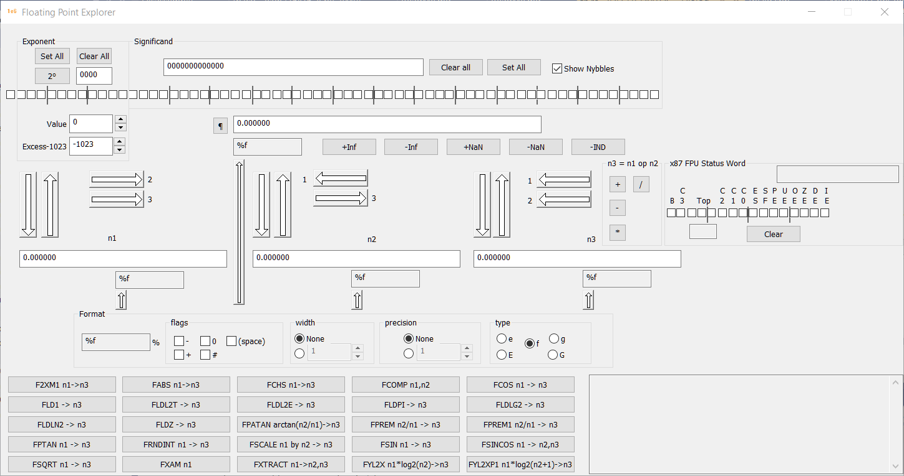

The screen is divided into several sections.  The upper part of the screen deals with the representation of a `double`.  The 64 check boxes represent the 64 bits of a `double`, shown in binary.  The high-order bit is the sign.  The next 11 bits are the exponent value, and the remaining 52 bits are the mantissa.

## The Exponent Box

The `Set All` and `Clear All` buttons will set or clear all the bits of the exponent.  The `2^0` button sets the exponent to represent `2^0`.

The edit control displays the exponent in hexadecimal.  You can type the desired hexadecimal exponent, which ranges from `0000` to `07FF`. 

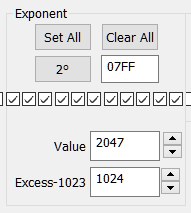

The `Value` edit control and associated spin control show and allow you to modify the exponent value, which is allowed to be in the range of `0..2047`.  However, the more natural represention would be the `Excess-1023` representation.  Thus 0 given in the `Excess-1023` control represents the absolute numeric `Value` in the exponent of 1023.

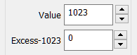

## TheSignificand Box

The `Set All` and `Clear All` buttons will set or clear all the bits of the significand. The representation also allows you to see the hexadecimal value of the significand, and edit it by changing the hex value displayed.

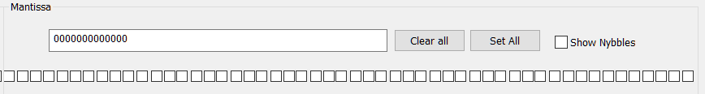

The `Show Nybbles` check box displays markers every four bits, making it somewhat easier to read the bits.

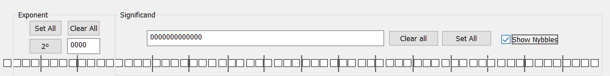

There are four buttons to select specific representations, such as `+inf`, `-inf`, `+Nan` and `-NaN`.  For the NaN representations, an exponent of all 1s and a nonzero mantissa is a NaN, and I arbitrarily chose to set the low-order bit of the mantissa to represent these values.  You can experiment with other bits.

## The Number
Together, all of these controls allow you to manipulate what is called "The Number". 

## The Working Registers

There are three "working registers" designated `n1`, `n2` and `n3`.

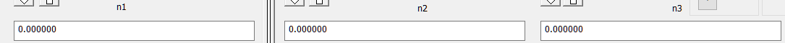

## Transferring to and from The Number

The large vertical arrow buttons pointing downward transfer a value from The Number to one of the three working registers.  The large upward pointing arrows transfer a value from one of the working registers to The Number, so it can be examined in detail.

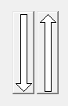

## Transferring Working Registers

The horizontal arrow buttons transfer a value from the working register below them to one of the other working registers. 

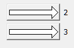
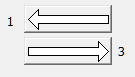
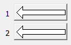

## The Operation buttons

The operation buttons perform the indicated operation `n3 = n1 op n2`. 

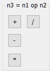

A typical sort of test might involve typing  value into `n1` (for example, 80), typing a value into `n2` (for example, 100) and performing an operation such as division, seeing the result in `n3`.  Then the large up-arrow above `n3` is clicked to transfer the result back to The Number so its representation can be examined.

### Formatting

The Format box allows you to select a `printf`-style format.

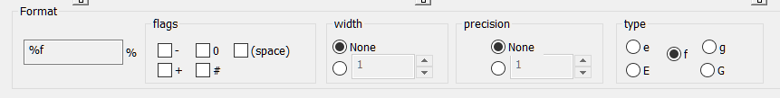

In terms of formatting, this also allows you to see the effects of the various formatting options you might use in a program.  The Format options allow selection of the flags, the width, the precision, and the type.  The formatting is shown to the left of the Format box.  The format can be associated with the display of `n1`, `n2`, `n3` or The Number by clicking one of the small arrow buttons.

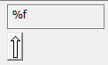

### The FPU ops buttons

An FPU has a number of built-in operations.  These instructions will be executed based on which button is clicked.  Each button specifies where it gets its operand(s) and where it puts its result.  The instructions used appear in the box on the right.

The buttons are arranged in alphabetical order, left-to-right, top-to-bottom.

The convention used is that when the instruction references the two top stack elements, referred to in the manuals as `ST(0)` and `ST(1)`, `n1` represents `ST(0)`` and 'n2' represents `ST(1)`.

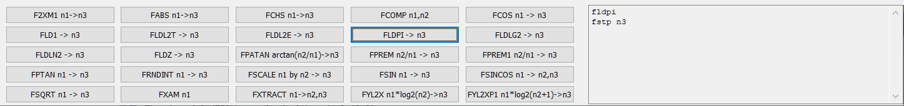

| Operation | Source | Destination | Function |
|---|:---:|:---:|---|
| F2XM1 | n1 | n3 | n3 = 2^n1 - 1 |
| FABS  | n1 | n3 | n3 = abs(n1) |
| FCHS | n1 | n3 | n3 = -n1 |
| FCOMP | n1 | n2 | |
| FCOS | n1 | n3 | n3 = cos(n1) |
| FLD1  |    | n3 | n3 = 1.0 |
| FLDPI |   | n3 | n3 = π |
| FLDL2E | | n3 | n3 = log2(_e_) |
| FLDL2T |  | n3 | n3 = log2(10) |
| FLDLG2| | n3 | n3 = log10(2) |
| FLDLN2 |   | n3 | n3 = ln(2) ||
| FLDZ | | n3 | n3 = 0.0 |
| FPATAN |n1,n2| n3 | n3 = arctan(n2 / n1) |
| FPREM |n1,n2| n3| |
| FPREM1 |n1,n2| n3 | n3 = ?(rnd(n1 / n2) * n2) |
| FPTAN | n1 | n3 | n3 = tan(n1) |
| FRNDINT | n1 | n3 | n2 = ⌈(int)n1 + 0.5⌉ |
| FSCALE | n1,n2| n3 | n3 = n1 * 2^(rnd0(n2)) |
| FSIN  | n1 | n3 | n3 = sin(n1) |
| FSINCOS |n1| n2,n3| n2 = sin(n1); n3 = cos(n1) |
| FSQRT | n1 | n3 | n3 = √n1 |
| FXAM | n1 |    |See table |
| FXTRACT | n1 | n2,n3| |
| FYL2X |n1,n2| n3 | n3 = n1 * log2(n2) |
| FYL2XP1 | n1,n2| n3 | n3 = n1 * log2(n2 + 1) |

`rnd0()` is round-towards-zero, that is, the fractional part is truncated and only the integer part is considered.

#### F2XM1 results

Computes 2^(n1) - 1. 'n1' must be in the range -1.0..+1.0

|n1 | n3 |  
|:---:    |:---:|
| -1.0 to -0 | -0.5 to -0 |
| -0 | -0 |
| +0 | +0 |
| +0 to +1.0 | +0 to 1.0 |

Note that values other than 2 can be exponentiated according to the formula
x^y = 2^(y * log2(x))

#### FABS results

|n1 | n3 |  
|:---:    |:---:|
| -∞ | +∞ |
| -F | +F |
| -0 | +0 |
| +0 | +0 |
| +F | +F |
| +∞ | +∞ |
| NaN | NaN |

#### FCHS results

|n1 | n3 |  
|:---:    |:---:|
| -∞ | +∞ |
| -F | +F |
| -0 | +0 |
| +0 | -0 |
| +F | -F |
| +∞ | -∞ |
| NaN | NaN |

#### FCOS results

|n1 | n3 |  
|:---:    |:---:|
| -∞ | \* |
| -F | -1 to +1 |
| -0 | +1 |
| +0 | +1 |
| +F | -1 to +1 |
| +∞ | \* |
| NaN | NaN |

* indicates an invalid-operand exception, which is indicated by the IE bit in the FPU Status Word

#### FPREM/FPREM1 results

|n1↓ n2→  | -∞  | -F  | -0  | +0  | +F  | +∞  | NaN |
|:---:    |:---:|:---:|:---:|:---:|:---:|:---:|:---:|
| -∞      | \*   | \*   | \*   | \*   | \*   | \*   | NaN |
| -F      | n1  | ±F or -0  | \*\*  | **  | ±F or -0 |  n1 | NaN |
| -0      | -0  | -0  | \*   | \*   | -0  | -0  | Nan |
| +0      | +0  | +0  | \*   | \*   | -0  | -0  | NaN |
| +F      | n1  | ±F or +0  | \*\*  | \*\*  | ±F or +0 | n1 | NaN |
| +∞      | \*   | \*   | \*   | \*   | \*   | \*   | NaN |
| Nan     | NaN | NaN | NaN | NaN | NaN | Nan | Nan |

"\*" indicates an invalid-operand exception, which is indicated by the IE bit in the FPU Status Word

#### FSIN results

|n1 | n3 |  
|:---:    |:---:|
| -∞ | \* |
| -F | -1 to +1 |
| -0 | -0 |
| +0 | +0 |
| +F | -1 to +1 |
| +∞ | \* |
| NaN | NaN |

#### FSINCOS results

|n1 | n2 sin | n3 cos |
|:---:    |:---:|:---:|
| -∞ | \* | \* |
| -F | -1 to +1 | -1 to +1 |
| -0 | -0 | +1 |
| +0 | +0 | +1 |
| +F | -1 to +1 | -1 to +1
| +∞ | \* | \* |
| NaN | NaN | Nan |

"\*" indicates an invalid-operand exception, which is indicated by the IE bit in the FPU Status Word

#### FSQRT results

|n1 | n3 |  
|:---:    |:---:|
| -∞ | \* |
| -F | \* |
| -0 | -0 |
| +0 | +0 |
| +F | √F |
| +∞ | +∞ |
| NaN | NaN |

#### FXTRACT results

This instruction extracts the exponent and the significand from the value in 'n1'.  The exponent, which is the power of 2, is  stored in `n2`, and the significand is stored in `n3`.  The significand is essentially identical to the significand in `n1`, except its exponent is 0, which means, in excess-1023 notation, it is 1023.

### The x87 FPU status word

For compatibilitly with existing libraries, there is an equivalent of the x87 FPU status register.  This appears on the right of the Explorer.  These bits are read-only boxes and cannot be set by the user.  However, they should be cleared before performing an operation you need to use them after, since they are not cleared automatically.

The small box under the "Top" bits decodes the stack pointer depth.

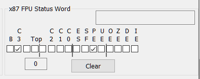

| Bit  | Mnemonic | Meaning |
|------|----------|---------|
| 15   | B        | |
| 14   | C3       | |
|13-11 | Top      | Stack pointer |
| 10   | C2       | |
| 9    | C1       | |
| 8    | C0       | |
| 7    | ES       | |
| 6    | SF       | |
| 5    | PE       | Inexact Precision |
| 4    | UE       | Underflow |
| 3    | OE       | Overflow |
| 2    | ZE       | Divide by zero |
| 1    | DE       | A Denormalized result occurred |
| 0    | IE       | Invalid result |

### FXAM condition codes

|Condition | C3 | C2 | C1 | C0 |
|---|:---:|:---:|:---:|:---:|
| Unsupported | 0 | 0 | | 0 |
| NaN         | 0 | 0 | | 1 |
| Normal finite number | 0 | 1 | | 0 |
| Infinity      | 0 | 1 | | 1 |
| Zero        | 1 | 0 | | 0 |
| Empty       | 1 | 0 | | 1 |
| Denormal number | 1 | 1 | | 0 |
| Negative    |   |   | 1 |   |

### Floating point condition codes
#### C0

| Instruction | Condition |
|---|---|
| FCOS | undefined |
| FRNDINT | undefined |
| FSCALE | undefined |
| FSIN | undefined |
| FSINCOS | undefined |
| FSQRT | undefined |
| FSUB | undefined |
| FXAM | _See FXAM table_ |

#### C1

| Instruction | Condition |
| FRNDINT | 0: Stack underflow |
|         | 1: Result was rounded up |
| FSCALE  | 0: Stack underflow or result was not rounded up |
|         | 1: Result was rounded up |
| FSIN    | 0: Stack underflow or result was not rounded up |
|         | 1: Result was rounded up |
| FSINCOS | 0: Stack underflow or result was not rounded up |
|         | 1: Result was rounded up |
| FSQRT   | 0: Stack underflow or result was not rounded up | 
|         | 1: Result was rounded up |
| FSUB    | 0: Stack underflow or result was not rounded up |
|         | 1: Result was rounded up |
| FXAM    | 0: Positive number |
|         | 1: Negative number |

#### C2

| Instruction | Condition |
|---|----| 
| FPTAN | 1: Operand outside acceptable range |
| FRNDINT | undefined |
| FSIN | 0: Source operand in valid range |
|      | 1: Source operand outside range (-2^63 < n1 < 2^63)
| FSINCOS | 0: Source operand in valid range |
|      | 1: Source operand outside range (-2^63 < n1 < 2^63)
| FSCALE | undefined |
| FSQRT | undefined |
| FSUB  | undefined |
| FXAM | _See FXAM table_ |

#### C3

| Instruction | Condition |
|---|----| 
| FCOS | undefined |
| FRNDINT | undefined |
| FSCALE | undefined |
| FSIN | undefined |
| FSINCOS | undefined |
| FSQRT | undefined |
| FSUB  | undefined |
| FXAM | _See FXAM table_ |

## 32-bit application

This is written as a 32-bit application.  It uses embedded `_asm` directives, which are not supported in the 64-bit compiler.  If you want to create a 64-bit version, please do it with `#ifdef` directives since the 64-bit intrinsics will not compile in the 32-bit version.

## Microsoft Foundation Class Output

### MICROSOFT FOUNDATION CLASS LIBRARY : fp Project Overview

The application wizard has created this `fp` application for 
you.  This application not only demonstrates the basics of using the Microsoft 
Foundation Classes but is also a starting point for writing your application.

This is a summary of what you will find in each of the files that
make up your fp application.

### Files

* `fp.vcproj`
     * This is the main project file for VC++ projects generated using an application wizard. 
It contains information about the version of Visual C++ that generated the file, and 
information about the platforms, configurations, and project features selected with the
application wizard.

* `fp.h`
    * This is the main header file for the application.  It includes other
project specific headers (including `Resource.h`) and declares the
`CfpApp` application class.

* `fp.cpp`
    * This is the main application source file that contains the application
class `CfpApp`.

* `fp.rc`
    * This is a listing of all of the Microsoft Windows resources that the
program uses.  It includes the icons, bitmaps, and cursors that are stored
in the `RES` subdirectory.  This file can be directly edited in Microsoft
Visual C++. Your project resources are in 1033.

* `res\fp.ico`
    * This is an icon file, which is used as the application's icon.  This
icon is included by the main resource file `fp.rc`.

* `res\fp.rc2`
   * This file contains resources that are not edited by Microsoft 
Visual C++. You should place all resources not editable by
the resource editor in this file.

### Classes

The application wizard creates one dialog class:
* `fpDlg.h`, `fpDlg.cpp` - the dialog
    * These files contain your `CfpDlg` class.  This class defines
the behavior of your application's main dialog.  The dialog's template is
in `fp.rc`, which can be edited in Microsoft Visual C++.

* `StdAfx.h`, `StdAfx.cpp`
    * These files are used to build a precompiled header (`.PCH`) file
named `fp.pch` and a precompiled types file named `StdAfx.obj`.

* `Resource.h`
    * This is the standard header file, which defines new resource IDs.
Microsoft Visual C++ reads and updates this file.

* `fp.manifest`
	* Application manifest files are used by Windows XP to describe an applications 
dependency on specific versions of Side-by-Side assemblies. The loader uses this 
information to load the appropriate assembly from the assembly cache or private 
from the application. The Application manifest  maybe included for redistribution 
as an external .manifest file that is installed in the same folder as the application 
executable or it may be included in the executable in the form of a resource. 

### Other notes:

If your application uses MFC in a shared DLL, and your application is in a 
language other than the operating system's current language, you will need 
to copy the corresponding localized resources `MFC70XXX.DLL` from the Microsoft
Visual C++ CD-ROM under the `Win\System directory` to your computer's system or 
`system32` directory, and rename it to be `MFCLOC.DLL`.  ("`XXX`" stands for the 
language abbreviation.  For example, `MFC70DEU.DLL` contains resources 
translated to German.)  If you don't do this, some of the UI elements of 
your application will remain in the language of the operating system.

